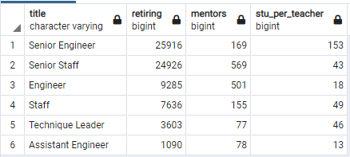

# Silver Tsunami Analysis
Determine the number of retiring employees per title, and identify employees who are eligible to participate in a mentorship program. Then, write a report that summarizes your analysis and helps prepare Bobby’s manager for the “silver tsunami” as many current employees reach retirement age.

## Overview of the analysis
The purpose of this analysis is to identify employees who are nearing retirement and eligible employees who can mentor other employees. This exercise will create and analyse two data sets:
- Retirement titles
- Mentorship eligibility

## Results
Here are the key takeaways from the analysis:
1. Over 90K employees are nearing retirement age.
2. Over half of those are Senior Engineers or Senior Staff. The data can be seen here: [Retiring Titles](Data/retiring_titles.csv).
3. There are 1549 employees who are eligible for mentorship program.
4. Out of those more than half are Senior Engineers or Senior Staff. This is a good sign since they can help replace most of the retiring employees

## Summary
Here is the summary of 'Silver Tsunami" analysis:
### How many roles will need to be filled as the "silver tsunami" begins to make an impact?
- Over 90K employees are nearing retirement age
### Are there enough qualified, retirement-ready employees in the departments to mentor the next generation of Pewlett Hackard employees?
- There are around 1500 employees that are eligible for mentorship. This means that each mentor will need to train 60 employees. This will not be an easy venture but can be achieved if its provided with right resources.

### Additional queries
- This query will help identify the count of titles available for mentorship:
SELECT COUNT(title) count, title 
FROM mentorship_eligibilty
GROUP BY title
ORDER BY count desc;
- This query will help identify how many students will need mentorship per teacher per title
SELECT rt.title, rt.count retiring, me.count mentors, rt.count/me.count stu_per_teacher
FROM
	(SELECT COUNT(title) count, title 
	FROM mentorship_eligibilty me
	GROUP BY title
	ORDER BY count desc) me
INNER JOIN retiring_titles rt ON rt.title = me.title
ORDER BY rt.count desc;
Here is the output: 
